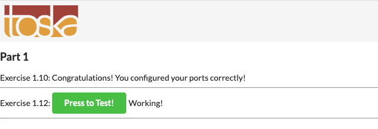
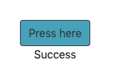
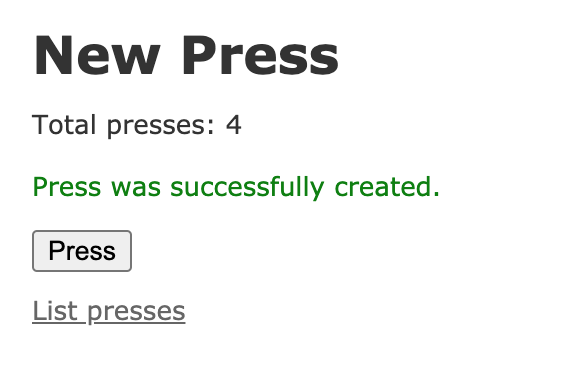

# Exercise 1.1

```bash
(base)$ docker ps -a
CONTAINER ID        IMAGE               COMMAND                  CREATED              STATUS                          PORTS               NAMES
286686bd4f09        mongo               "docker-entrypoint.s…"   About a minute ago   Exited (0) 9 seconds ago                            competent_galois
839a7e9320e1        mongo               "docker-entrypoint.s…"   2 minutes ago        Exited (0) About a minute ago                       hopeful_gagarin
b7995d810319        nginx               "/docker-entrypoint.…"   3 minutes ago        Exited (0) 17 seconds ago                           serene_austin
bfe1da111c09        nginx               "/docker-entrypoint.…"   3 minutes ago        Up 3 minutes                    80/tcp              zen_golick
8eedb1eb883e        nginx               "/docker-entrypoint.…"   4 minutes ago        Exited (0) 3 minutes ago                            focused_hodgkin
46778f625800        node                "docker-entrypoint.s…"   4 minutes ago        Exited (0) 4 minutes ago                            modest_poitras
5a3d82ad7267        nginx               "/docker-entrypoint.…"   6 minutes ago        Up 6 minutes                    80/tcp              inspiring_goldstine
d6bdf7a2958f        nginx               "/docker-entrypoint.…"   15 minutes ago       Exited (0) 14 minutes ago                           quirky_wescoff
```

# Exercise 1.2

```bash
(base)$ docker ps -a
CONTAINER ID        IMAGE               COMMAND             CREATED             STATUS              PORTS               NAMES
(base)$ docker images
REPOSITORY          TAG                 IMAGE ID            CREATED             SIZE
(base)$ 
```

# Exercise 1.3

```bash
(base)$ docker run -it devopsdockeruh/pull_exercise
Give me the password: basics
You found the correct password. Secret message is:
"This is the secret message"
```

# Exercise 1.4

```bash
(base)$ docker run -it devopsdockeruh/exec_bash_exercise
(base)$ docker ps -a
(base) $ docker exec -it confident_banach bash
root@f9a95d0b0760:/usr/app# tail -f ./logs.txt
Secret message is:
"Docker is easy"
Fri, 17 Jul 2020 16:38:38 GMT
Fri, 17 Jul 2020 16:38:41 GMT
Fri, 17 Jul 2020 16:38:44 GMT
Fri, 17 Jul 2020 16:38:47 GMT
^C
root@f9a95d0b0760:/usr/app# exit
```

# Exercise 1.5

```bash
(base) $ docker run -d -it --name ubu1.5 ubuntu:16.04 
5d0148106190cd5ddd4a7e3f1866d70f1ffd1f6a70e13263c4c5cc95a9a648ac
(base) $ docker exec -it ubu1.5 apt-get update
Get:1 http://archive.ubuntu.com/ubuntu xenial InRelease [247 kB]
...
(base) $ docker exec -it ubu1.5 apt-get install curl
Reading package lists... Done
Building dependency tree       
Reading state information... Done
The following additional packages will be installed:
...
(base) $ docker exec -it ubu1.5  sh -c 'echo "Input website:"; read website; echo "Searching.."; sleep 1; curl http://$website;'
Input website:
helsinki.fi
Searching..
<!DOCTYPE HTML PUBLIC "-//IETF//DTD HTML 2.0//EN">
<html><head>
<title>301 Moved Permanently</title>
</head><body>
<h1>Moved Permanently</h1>
<p>The document has moved <a href="http://www.helsinki.fi/">here</a>.</p>
</body></html>
(base) $ 
```

# Exercise 1.6

Dockerfile: ./exec-1.6/Dockerfile

```bash
(base) $ docker build -t docker-clock .
Sending build context to Docker daemon  2.048kB
Step 1/2 : FROM devopsdockeruh/overwrite_cmd_exercise
 ---> 3d2b622b1849
Step 2/2 : CMD ["-c"]
 ---> Running in 9df2c4170437
Removing intermediate container 9df2c4170437
 ---> 18096575d4a1
Successfully built 18096575d4a1
Successfully tagged docker-clock:latest
(base) $ docker run docker-clock
1
2
3
4
5...
```

# Exercise 1.7.

```bash
(base)$ docker build -t curler .
Sending build context to Docker daemon  3.072kB
Step 1/7 : FROM ubuntu:16.04
 ---> c522ac0d6194
Step 2/7 : WORKDIR /dir
 ---> Using cache
 ---> 1073d915fe98
Step 3/7 : RUN apt-get update && apt-get install -y curl
 ---> Using cache
 ---> 8af70b787307
Step 4/7 : COPY script.sh .
 ---> Using cache
 ---> aab5846a87a0
Step 5/7 : RUN chmod +x ./script.sh
 ---> Using cache
 ---> d8f34e7eed33
Step 6/7 : ENTRYPOINT ["./script.sh"]
 ---> Using cache
 ---> 7193c16df706
Step 7/7 : CMD ["sh -c"]
 ---> Using cache
 ---> 4de1bc6afa71
Successfully built 4de1bc6afa71
Successfully tagged curler:latest
(base)$ docker run -it curler
Input website:
helsinki.fi
Searching..
<!DOCTYPE HTML PUBLIC "-//IETF//DTD HTML 2.0//EN">
<html><head>
<title>301 Moved Permanently</title>
</head><body>
<h1>Moved Permanently</h1>
<p>The document has moved <a href="http://www.helsinki.fi/">here</a>.</p>
</body></html>
(base)$ 
```

# Exercise 1.8

```bash
(base) $ docker run --name volume devopsdockeruh/first_volume_exercise
Wrote to file /usr/app/logs.txt
Wrote to file /usr/app/logs.txt
^CClosing file
(base) $ docker cp "volume://usr/app/" .
(base) $ docker run -v "$(pwd)"/app/logs.txt:/usr/app/logs.txt devopsdockeruh/first_volume_exercise
Wrote to file /usr/app/logs.txt
Wrote to file /usr/app/logs.txt
Wrote to file /usr/app/logs.txt
Wrote to file /usr/app/logs.txt
Wrote to file /usr/app/logs.txt
Wrote to file /usr/app/logs.txt
Wrote to file /usr/app/logs.txt
Wrote to file /usr/app/logs.txt
^CClosing file
(base) $ cat app/logs.txt
Sun, 19 Jul 2020 09:18:31 GMT
Sun, 19 Jul 2020 09:18:34 GMT
Sun, 19 Jul 2020 09:18:37 GMT
Sun, 19 Jul 2020 09:18:40 GMT
Secret message is:
"Volume bind mount is easy"
Sun, 19 Jul 2020 09:18:46 GMT
Sun, 19 Jul 2020 09:18:49 GMT
Sun, 19 Jul 2020 09:18:52 GMT
(base) $ 
```

# Exercixe 1.9

```bash
(base) $ docker run -d -p 80 devopsdockeruh/ports_exercise
Unable to find image 'devopsdockeruh/ports_exercise:latest' locally
latest: Pulling from devopsdockeruh/ports_exercise
cbdbe7a5bc2a: Pull complete 
fb0e3739aee1: Pull complete 
738de7869598: Pull complete 
ffd68be3d86c: Pull complete 
d6a92ac5065d: Pull complete 
8deb0960be38: Pull complete 
aec7a3bd83e0: Pull complete 
8f73392c117e: Pull complete 
Digest: sha256:9779e303353ef47da9ea0223bfbb9fbdb8f8fe39178e2e06153027e28e9e5400
Status: Downloaded newer image for devopsdockeruh/ports_exercise:latest
e76a295bed4bcb54919b1b6fed2819b3f58b8c27032c385985c8b86ef0152e91
(base) $ docker port e7
80/tcp -> 0.0.0.0:32768
(base) $ 
```

# Exercise 1.10

Dockerfile: ./exec-1.10/Dockerfile

# Exercise 1.11

Dockerfile: ./exec-1.11/Dockerfile


```bash
(base) $ docker build -t back .
Sending build context to Docker daemon  437.8kB
Step 1/5 : FROM node
 ---> 37ad18cd8bd1
Step 2/5 : EXPOSE 8000
 ---> Using cache
 ---> 37c5bb948cd8
Step 3/5 : COPY . .
 ---> Using cache
 ---> d34cab776c0f
Step 4/5 : RUN npm install && npm install cross-env
 ---> Using cache
 ---> 96c903840785
Step 5/5 : CMD ["npm", "start"]
 ---> Using cache
 ---> 2038a5b87365
Successfully built 2038a5b87365
Successfully tagged back:latest
(base) $ docker run -p 8000:8000 -v "$(pwd)"/logs.txt:/logs.txt back

> backend-example-docker@1.0.0 start /
> cross-env NODE_ENV=production node index.js

Browserslist: caniuse-lite is outdated. Please run next command `npm update caniuse-lite browserslist`
[BABEL] Note: The code generator has deoptimised the styling of /node_modules/sequelize/node_modules/lodash/lodash.js as it exceeds the max of 500KB.
Started on port 8000


```

# Exercise 1.12

Dockerfiles: ./exec-1.12/Dockerfile & Dockerfile-back



```bash
(base) $ docker build -t front .
Sending build context to Docker daemon  974.8kB
Step 1/7 : FROM node
 ---> 37ad18cd8bd1
Step 2/7 : ENV NODE_ENV="production"
 ---> Using cache
 ---> e533807f4659
Step 3/7 : ENV API_URL="http://localhost:8000"
 ---> Using cache
 ---> 3197cc5cb545
Step 4/7 : EXPOSE 5000
 ---> Using cache
 ---> 29bce8e9e9b3
Step 5/7 : COPY . .
 ---> Using cache
 ---> 8559896c7782
Step 6/7 : RUN npm install
 ---> Using cache
 ---> d020dfd7046a
Step 7/7 : CMD ["npm", "start"]
 ---> Using cache
 ---> d2a746b64503
Successfully built d2a746b64503
Successfully tagged front:latest
(base) $ docker run -p 5000:5000 front

> frontend-example-docker@1.0.0 start /
> webpack --mode production && serve -s -l 5000 dist

Hash: 2865b5d9075abb5ad112
Version: webpack 4.42.1
Time: 22419ms
Built at: 07/19/2020 1:00:39 PM
                                 Asset       Size  Chunks                    Chunk Names
0ab54153eeeca0ce03978cc463b257f7.woff2   39.2 KiB          [emitted]         
  13db00b7a34fee4d819ab7f9838cc428.eot   96.3 KiB          [emitted]         
  701ae6abd4719e9c2ada3535a497b341.eot   30.4 KiB          [emitted]         
  82f60bd0b94a1ed68b1e6e309ce2e8c3.svg    105 KiB          [emitted]         
  8e3c7f5520f5ae906c6cf6d7f3ddcd19.eot    104 KiB          [emitted]         
  962a1bf31c081691065fe333d9fa8105.svg    382 KiB          [emitted]  [big]  
  9c74e172f87984c48ddf5c8108cabe67.png   27.5 KiB          [emitted]         
 a046592bac8f2fd96e994733faf3858c.woff   62.2 KiB          [emitted]         
  a1a749e89f578a49306ec2b055c073da.svg    496 KiB          [emitted]  [big]  
  a3e2211dddcba197b5bbf2aa9d5d9a9a.svg   3.19 KiB          [emitted]         
  ad97afd3337e8cda302d10ff5a4026b8.ttf   30.2 KiB          [emitted]         
  b87b9ba532ace76ae9f6edfe9f72ded2.ttf    103 KiB          [emitted]         
  bff6c47a9da5c7cfa2e8a552e2df3a78.svg    3.2 KiB          [emitted]         
  c5ebe0b32dc1b5cc449a76c4204d13bb.ttf   96.1 KiB          [emitted]         
cd6c777f1945164224dee082abaea03a.woff2     12 KiB          [emitted]         
e8c322de9658cbeb8a774b6624167c2c.woff2   53.2 KiB          [emitted]         
 ef60a4f6c25ef7f39f2d25a748dbecfe.woff   14.4 KiB          [emitted]         
 faff92145777a3cbaf8e7367b4807987.woff   49.3 KiB          [emitted]         
                            index.html  454 bytes          [emitted]         
                              main.css  127 bytes       0  [emitted]         main
                               main.js   21.8 KiB       0  [emitted]         main
                    vendors~main-1.css    602 KiB       1  [emitted]  [big]  vendors~main
                       vendors~main.js    342 KiB       1  [emitted]  [big]  vendors~main
           vendors~main.js.LICENSE.txt   1.37 KiB          [emitted]         
Entrypoint main [big] = vendors~main-1.css vendors~main.js main.css main.js
  [7] /node_modules/semantic-ui-react/dist/es/lib/index.js + 1 modules 2.94 KiB {1} [built]
      |    2 modules
 [51] /node_modules/semantic-ui-react/dist/es/elements/Icon/Icon.js + 1 modules 6.22 KiB {1} [built]
      |    2 modules
 [80] /node_modules/react-redux/es/index.js + 19 modules 37 KiB {1} [built]
      |    20 modules
 [93] /node_modules/semantic-ui-react/dist/es/elements/Label/Label.js + 2 modules 10.6 KiB {1} [built]
      |    3 modules
[212] (webpack)/buildin/global.js 472 bytes {1} [built]
[251] /src/assets/toscalogo_color.svg 82 bytes {0} [built]
[252] /src/assets/toscalogo_grayscale.svg 82 bytes {0} [built]
[270] multi @babel/polyfill ../src 40 bytes {0} [built]
[464] (webpack)/buildin/harmony-module.js 573 bytes {1} [built]
[466] /src/assets/custom.css 39 bytes {0} [built]
[602] /src/index.js + 18 modules 42.1 KiB {0} [built]
      | /src/index.js 609 bytes [built]
      | /src/util/store.js 481 bytes [built]
      | /util/common.js 117 bytes [built]
      | /src/util/apiConnection.js 4.57 KiB [built]
      | /src/util/redux/index.js 219 bytes [built]
      | /src/util/redux/messageReducer.js 2.15 KiB [built]
      | /src/util/redux/simpleReducer.js 1.86 KiB [built]
      | /src/util/common.js 221 bytes [built]
      |     + 11 hidden modules
[603] /node_modules/semantic-ui-react/dist/es/elements/Button/Button.js + 3 modules 17.7 KiB {1} [built]
      |    4 modules
[612] /node_modules/react-router-dom/es/BrowserRouter.js + 12 modules 41 KiB {1} [built]
      |    13 modules
[614] /node_modules/react-router-dom/es/Switch.js + 1 modules 3.35 KiB {1} [built]
      |    2 modules
[615] /node_modules/react-router-dom/es/Route.js + 1 modules 5.9 KiB {1} [built]
      |    2 modules
    + 989 hidden modules

WARNING in asset size limit: The following asset(s) exceed the recommended size limit (244 KiB).
This can impact web performance.
Assets: 
  962a1bf31c081691065fe333d9fa8105.svg (382 KiB)
  a1a749e89f578a49306ec2b055c073da.svg (496 KiB)
  vendors~main-1.css (602 KiB)
  vendors~main.js (342 KiB)

WARNING in entrypoint size limit: The following entrypoint(s) combined asset size exceeds the recommended limit (244 KiB). This can impact web performance.
Entrypoints:
  main (966 KiB)
      vendors~main-1.css
      vendors~main.js
      main.css
      main.js


WARNING in webpack performance recommendations: 
You can limit the size of your bundles by using import() or require.ensure to lazy load some parts of your application.
For more info visit https://webpack.js.org/guides/code-splitting/
Child html-webpack-plugin for "index.html":
     1 asset
    Entrypoint undefined = index.html
    [2] (webpack)/buildin/global.js 472 bytes {0} [built]
    [3] (webpack)/buildin/module.js 497 bytes {0} [built]
        + 2 hidden modules
Child mini-css-extract-plugin node_modules/css-loader/index.js!node_modules/semantic-ui-css/semantic.min.css:
    Entrypoint mini-css-extract-plugin = *
       19 modules
Child mini-css-extract-plugin node_modules/css-loader/index.js!src/assets/custom.css:
    Entrypoint mini-css-extract-plugin = *
    [0] /node_modules/css-loader!/src/assets/custom.css 340 bytes {0} [built]
        + 1 hidden module
UPDATE AVAILABLE The latest version of `serve` is 11.3.2
INFO: Accepting connections at http://localhost:5000


....

(base) $ docker build -t back .
Sending build context to Docker daemon  402.4kB
Step 1/6 : FROM node
 ---> 37ad18cd8bd1
Step 2/6 : ENV FRONT_URL="http://localhost:5000"
 ---> Running in a07c84e92614
Removing intermediate container a07c84e92614
 ---> af5f070c0eb1
Step 3/6 : EXPOSE 8000
 ---> Running in 83c81473ee4b
Removing intermediate container 83c81473ee4b
 ---> 7ae17d68bb14
Step 4/6 : COPY . .
 ---> ed8579d83dc5
Step 5/6 : RUN npm install
 ---> Running in 0744cfb4ffa9

> nodemon@1.18.9 postinstall /node_modules/nodemon
> node bin/postinstall || exit 0

Love nodemon? You can now support the project via the open collective:
 > https://opencollective.com/nodemon/donate

npm WARN optional SKIPPING OPTIONAL DEPENDENCY: fsevents@1.2.4 (node_modules/fsevents):
npm WARN notsup SKIPPING OPTIONAL DEPENDENCY: Unsupported platform for fsevents@1.2.4: wanted {"os":"darwin","arch":"any"} (current: {"os":"linux","arch":"x64"})

added 488 packages from 286 contributors and audited 556 packages in 12.935s
found 607 vulnerabilities (339 low, 268 high)
  run `npm audit fix` to fix them, or `npm audit` for details
Removing intermediate container 0744cfb4ffa9
 ---> c4b64302cd92
Step 6/6 : CMD ["npm", "start"]
 ---> Running in a320d983e82c
Removing intermediate container a320d983e82c
 ---> ea3a4a5009c6
Successfully built ea3a4a5009c6
Successfully tagged back:latest
(base) $ docker run -p 8000:8000 back

> backend-example-docker@1.0.0 start /
> cross-env NODE_ENV=production node index.js

Browserslist: caniuse-lite is outdated. Please run next command `npm update caniuse-lite browserslist`
[BABEL] Note: The code generator has deoptimised the styling of /node_modules/sequelize/node_modules/lodash/lodash.js as it exceeds the max of 500KB.
Started on port 8000

```
Working!


# Exercise 1.13



```bash

base) $ docker build -t javadoc .
Sending build context to Docker daemon  107.5kB
Step 1/6 : FROM openjdk:8
8: Pulling from library/openjdk
e9afc4f90ab0: Already exists 
989e6b19a265: Already exists 
af14b6c2f878: Already exists 
5573c4b30949: Already exists 
fb1a405f128d: Pull complete 
197b0f525c26: Pull complete 
35daf494cd0f: Pull complete 
Digest: sha256:3867335e47b448b63c5329e0f5c762368f19fca9af8c1d957fa2bf7d63fe0829
Status: Downloaded newer image for openjdk:8
 ---> 51d6b33ebe8a
Step 2/6 : COPY . /usr/src/myapp
 ---> a932a49b12db
Step 3/6 : WORKDIR /usr/src/myapp
 ---> Running in ceb4690b1718
Removing intermediate container ceb4690b1718
 ---> a5b9936a7ed6
Step 4/6 : RUN ./mvnw package
 ---> Running in 6903f64ff4ed

......

[INFO] Total time:  36.515 s
[INFO] Finished at: 2020-07-19T17:48:23Z
[INFO] ------------------------------------------------------------------------
Removing intermediate container 6903f64ff4ed
 ---> 28cb050abd4c
Step 5/6 : EXPOSE 8080
 ---> Running in a305ddff2d38
Removing intermediate container a305ddff2d38
 ---> d11ab7345911
Step 6/6 : CMD ["java", "-jar", "./target/docker-example-1.1.3.jar"]
 ---> Running in 439a414e57df
Removing intermediate container 439a414e57df
 ---> 7793126f84f6
Successfully built 7793126f84f6
Successfully tagged javadoc:latest

(base) $ docker run -p 8080:8080 -it --name javad javadoc

  .   ____          _            __ _ _
 /\\ / ___'_ __ _ _(_)_ __  __ _ \ \ \ \
( ( )\___ | '_ | '_| | '_ \/ _` | \ \ \ \
 \\/  ___)| |_)| | | | | || (_| |  ) ) ) )
  '  |____| .__|_| |_|_| |_\__, | / / / /
 =========|_|==============|___/=/_/_/_/
 :: Spring Boot ::        (v2.1.3.RELEASE)

...
2020-07-19 17:56:16.701  INFO 1 --- [nio-8080-exec-1] o.s.web.servlet.DispatcherServlet        : Completed initialization in 12 ms

```

# Exercise 1.14

Dockerfiles: ./exec-1.14/Dockerfile & Dockerfile-back



```bash
(base) $ docker build -t rubys .
Sending build context to Docker daemon  236.5kB
Step 1/8 : FROM ruby:2.6.0
 ---> ef8778f370d5
Step 2/8 : RUN gem install bundler
 ---> Using cache
 ---> 1e2667a622ca
Step 3/8 : EXPOSE 3000
 ---> Using cache
 ---> 95d026681b4b
Step 4/8 : COPY . .
 ---> 72c0afbd1b65
Step 5/8 : RUN bundle install
 ---> Running in 5244f5ec8bc5
....
Removing intermediate container 347de9c902b7
 ---> 054c8b1dc3b2
Step 7/8 : RUN rails db:migrate
 ---> Running in 62b4679d8be7
== 20190314120316 CreatePresses: migrating ====================================
-- create_table(:presses)
   -> 0.0008s
== 20190314120316 CreatePresses: migrated (0.0016s) ===========================

Removing intermediate container 62b4679d8be7
 ---> 65193800f1a1
Step 8/8 : CMD ["rails" ,"s" ]
 ---> Running in efa696aae514
Removing intermediate container efa696aae514
 ---> 764a9d8de6b3
Successfully built 764a9d8de6b3
Successfully tagged rubys:latest
(base) $ docker run -it -p 3000:3000 rubys
=> Booting Puma
=> Rails 5.2.2.1 application starting in development 
=> Run `rails server -h` for more startup options
Puma starting in single mode...
* Version 3.12.0 (ruby 2.6.0-p0), codename: Llamas in Pajamas
* Min threads: 5, max threads: 5
* Environment: development
* Listening on tcp://0.0.0.0:3000
Use Ctrl-C to stop
Started GET "/" for 172.17.0.1 at 2020-07-20 05:16:46 +0000
....
Completed 200 OK in 612ms (Views: 597.0ms | ActiveRecord: 0.9ms)


Started POST "/presses" for 172.17.0.1 at 2020-07-20 05:16:49 +0000
....
Redirected to http://localhost:3000/presses/new
Completed 302 Found in 16ms (ActiveRecord: 6.4ms)


^C- Gracefully stopping, waiting for requests to finish
=== puma shutdown: 2020-07-20 05:19:26 +0000 ===
- Goodbye!
Exiting
```

# Exercise 1.15

https://hub.docker.com/repository/docker/auuaa/fs-puhelinluettelo/


# Exercise 1.16

https://dockerfun.herokuapp.com/