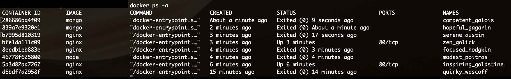

# Exercise 1.1


```
(base)$ docker ps -a
CONTAINER ID        IMAGE               COMMAND                  CREATED              STATUS                          PORTS               NAMES
286686bd4f09        mongo               "docker-entrypoint.s…"   About a minute ago   Exited (0) 9 seconds ago                            competent_galois
839a7e9320e1        mongo               "docker-entrypoint.s…"   2 minutes ago        Exited (0) About a minute ago                       hopeful_gagarin
b7995d810319        nginx               "/docker-entrypoint.…"   3 minutes ago        Exited (0) 17 seconds ago                           serene_austin
bfe1da111c09        nginx               "/docker-entrypoint.…"   3 minutes ago        Up 3 minutes                    80/tcp              zen_golick
8eedb1eb883e        nginx               "/docker-entrypoint.…"   4 minutes ago        Exited (0) 3 minutes ago                            focused_hodgkin
46778f625800        node                "docker-entrypoint.s…"   4 minutes ago        Exited (0) 4 minutes ago                            modest_poitras
5a3d82ad7267        nginx               "/docker-entrypoint.…"   6 minutes ago        Up 6 minutes                    80/tcp              inspiring_goldstine
d6bdf7a2958f        nginx               "/docker-entrypoint.…"   15 minutes ago       Exited (0) 14 minutes ago                           quirky_wescoff
```