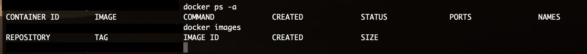

# Exercise 2



```
(base)$ docker ps -a
CONTAINER ID        IMAGE               COMMAND             CREATED             STATUS              PORTS               NAMES
(base)$ docker images
REPOSITORY          TAG                 IMAGE ID            CREATED             SIZE
(base)$ 

```