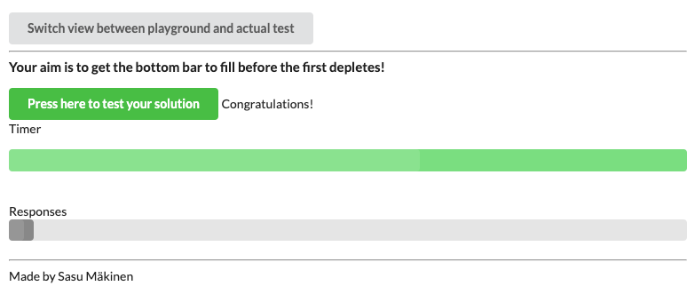
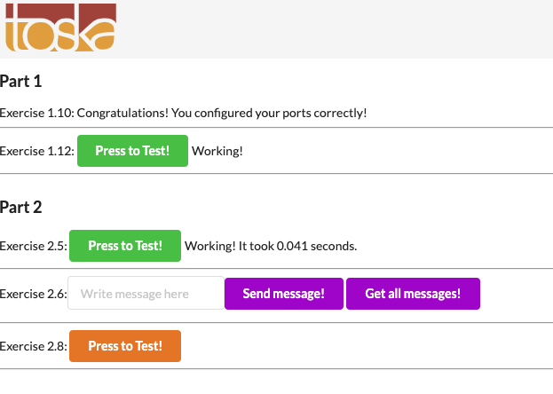
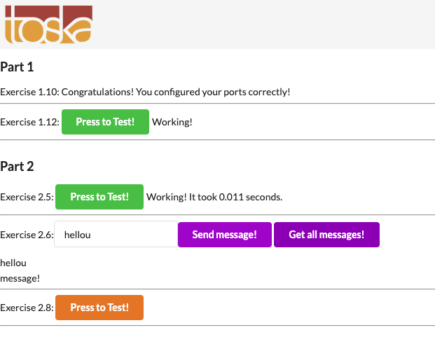
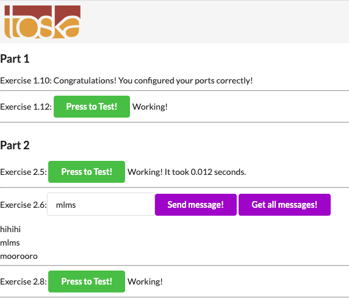

# Exercise 2.1

Docker-compose: [docker-compose 2.1](./exec-2.1/docker-compose.yaml)

```bash
(base) $ docker-compose up
Creating network "app_default" with the default driver
Creating first-volume ... done
Attaching to first-volume
first-volume    | Wrote to file /usr/app/logs.txt
first-volume    | Wrote to file /usr/app/logs.txt
first-volume    | Wrote to file /usr/app/logs.txt
^CGracefully stopping... (press Ctrl+C again to force)
Stopping first-volume ... done

```


# Exercise 2.2

Docker-compose: [docker-compose 2.2](./exec-2.2/docker-compose.yaml)

```bash
(base) $ docker-compose up
Creating ports_exercise ... done
Attaching to ports_exercise
ports_exercise    | 
ports_exercise    | > ports_exercise@1.0.0 start /usr/app
ports_exercise    | > node index.js
ports_exercise    | 
ports_exercise    | Listening on port 80, this means inside of the container. Use -p to map the port to a port of your local machine.
```

Ports configured correctly!!

# Exercise 2.3

Docker-compose: [docker-compose 2.3](./exec-2.3/docker-compose.yaml)

```bash
(base) $ docker-compose up
Building backend
Step 1/6 : FROM node
 ---> 37ad18cd8bd1
...
Building frontend
Step 1/7 : FROM node
 ---> 37ad18cd8bd1
....
Creating testing_frontend_1 ... done
Creating testing_backend_1  ... done
Attaching to testing_frontend_1, testing_backend_1
backend_1   | 
backend_1   | > backend-example-docker@1.0.0 start /
backend_1   | > cross-env NODE_ENV=production node index.js
backend_1   | 
frontend_1  | 
frontend_1  | > frontend-example-docker@1.0.0 start /
frontend_1  | > webpack --mode production && serve -s -l 5000 dist
...
backend_1   | Started on port 8000
...
frontend_1  | INFO: Accepting connections at http://localhost:5000
```

# Exercise 2.4



```bash
(base) $ docker-compose up -d --scale compute=4
Starting calculator                 ... done
Starting load-balancer              ... done
Starting scaling-exercise_compute_1 ... done
Creating scaling-exercise_compute_2 ... done
Creating scaling-exercise_compute_3 ... done
Creating scaling-exercise_compute_4 ... done
```

# Exercise 2.5

Docker-compose: [docker-compose 2.5](./exec-2.5/docker-compose.yaml)



```bash
backend_1   | Got from redis pong
```

# Exercise 2.6

Docker-compose: [docker-compose 2.6](./exec-2.6/docker-compose.yaml)



```bash
backend_1   | Executing (default): INSERT INTO "messages" ("id","body","createdAt","updatedAt") VALUES (DEFAULT,$1,$2,$3) RETURNING *;
backend_1   | Executing (default): INSERT INTO "messages" ("id","body","createdAt","updatedAt") VALUES (DEFAULT,$1,$2,$3) RETURNING *;
backend_1   | Executing (default): SELECT "id", "body", "createdAt", "updatedAt" FROM "messages" AS "message";
backend_1   | Got from redis pong
```

# Exercise 2.7

Docker-compose: [docker-compose 2.7](./exec-2.7/docker-compose.yaml)

# Exercise 2.8

Docker-compose: [docker-compose 2.8](./exec-2.8/docker-compose.yaml)

# Exercise 2.9

Docker-compose: [docker-compose 2.9](./exec-2.9/docker-compose.yaml)

# Exercise 2.10



Docker-compose: [docker-compose 2.10](./exec-2.10/docker-compose.yaml)

all the environment variables are moved to docker-compose file and pointing to correct (proxy) urls